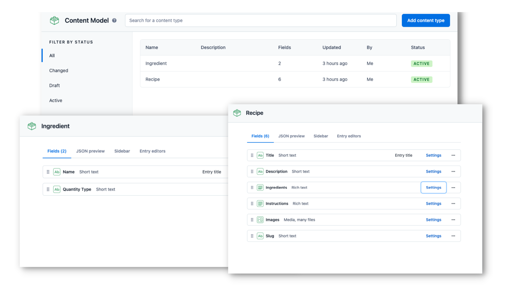

# Contentful JavaScript Cookbook Starter

Create a JavaScript cookbook powered by [Contentful](https://www.contentful.com/).

## Demo

[https://javascript-contentful-starter.herokuapp.com/](https://javascript-contentful-starter.herokuapp.com/)


## Features

- Simple content model and structure. Easy to adjust to your needs.
- Uses the [Contentful JavaScript SDK](https://www.npmjs.com/package/contentful) to fetch the content.
- Uses the [rich-text-html-renderer](https://www.npmjs.com/package/@contentful/rich-text-html-renderer) to render Rich Text.

## Quick Start

Follow the steps mentioned below to set up and run the project quickly. For more detailed instructions, follow the steps mentioned in [Configuration](#configuration).

### Step 1. Get the source code and install dependencies

Clone the repository.

```bash
git clone https://github.com/contentful/starter-javascript-cookbook.git
```

Install node dependencies.

```bash
npm install

# or

yarn add
```

### Step 2. Set up the content model

The project comes with a Contentful set up command that imports the required content model and adds sample content to your space.

The command asks you for a [Space ID](https://www.contentful.com/help/find-space-id/), and [Content Management API](https://www.contentful.com/developers/docs/references/content-management-api/) Access Token, and the [Conetnt Delivery API](https://www.contentful.com/developers/docs/references/content-delivery-api/) Access Token.

Run the following command to set up the content model.

```bash
CONTENTFUL_SPACE_ID=XXX CONTENTFUL_MANAGEMENT_TOKEN=XXX CONTENTFUL_DELIVERY_TOKEN=XXX npm run setup
```

### Step 3. Run it locally

```bash
npm run dev
```

Navigate to `localhost:3000` to view the Cookbook app.

## Configuration

### Step 1. Create an account and a space on Contentful

First, [create an account on Contentful](https://www.contentful.com/sign-up/).

After creating an account, create a new empty **space** from the [dashboard](https://app.contentful.com/) and assign to it any name of your liking.

### Step 2. Create a content model

The [content model](https://www.contentful.com/developers/docs/concepts/data-model/) defines the data structures of your application/websites. The structures are flexible and you can tailor them to your needs.

For this example you need to create a content model that defines an ingredient and a recipe content type. **You can create these two by running a script or by doing it manually** to familiarize yourself with the Contentful user interface.

#### Run a script to create the content model

This project includes a setup script which you can use to set up the content model expected by the source code.

In your Contentful dashboard go to **Settings > General Settings** and copy the **Space ID**.

Next, go to **Settings > API keys > Content management tokens** and create a new token by clicking **Generate personal token**. This token has the same access rights as the logged in user. **Do not share it publicly**, you will only use it to set up your space and can delete it afterwards.

With the space ID and management access token at hand run the following command:

```bash
CONTENTFUL_SPACE_ID=XXX CONTENTFUL_MANAGEMENT_TOKEN=XXX CONTENTFUL_DELIVERY_TOKEN=XXX npm run setup
```

This command will create the needed content structures and set up your Contentful space ready to use. The output should look as follows:

```
> starter-javascript-cookbook@0.0.1 setup
> node ./contentful/setup.js

┌──────────────────────────────────────────────────┐
│ The following entities are going to be imported: │
├────────────────────────────────┬─────────────────┤
│ Content Types                  │ 2               │
├────────────────────────────────┼─────────────────┤
│ Tags                           │ 0               │
├────────────────────────────────┼─────────────────┤
│ Editor Interfaces              │ 2               │
├────────────────────────────────┼─────────────────┤
│ Entries                        │ 34              │
├────────────────────────────────┼─────────────────┤
│ Assets                         │ 3               │
├────────────────────────────────┼─────────────────┤
│ Locales                        │ 1               │
├────────────────────────────────┼─────────────────┤
│ Webhooks                       │ 0               │
└────────────────────────────────┴─────────────────┘
(node:8716) ExperimentalWarning: The Fetch API is an experimental feature. This feature could change at any time
(Use `node --trace-warnings ...` to show where the warning was created)
  ✔ Validating content-file
  ✔ Initialize client (1s)
  ✔ Checking if destination space already has any content and retrieving it (2s)
  ✔ Apply transformations to source data (1s)
  ✔ Push content to destination space
    ✔ Connecting to space (1s)
    ✔ Connecting to space (1s)
   ...
   ...
   ...
```

#### Create the content model manually

##### Create an `Ingredient` content type

From your contentful space, go to **Content model** and add a new content type:

- Give it the **Name** `Ingredient`, the **Api Identifier** should be `ingredient`

Once the content model is saved, add these fields (you don't have to modify the settings unless specified):

- `Name` - **Text** field (type **short text**).
- `Quantity Type` - **Text** field (type **short text**).
  - Click on **Create and configure**.
  - Under **Validation**, check **_Accept only specifed values_** and enter a few values.
  - You can optionally go to **Appearance** and select **Dropdown**.

Save the content type and continue.

##### Create a `Recipe` type

From your contentful space, go to **Content model** and add another content type:

- Give it the **Name** `Recipe`, the **Api Identifier** should be `recipe`

Next, add these fields (you don't have to modify the settings unless specified):

- `Title` - **Text** field (type **short text**)
- `Description` - **Text** field (type **short text**)
- `Ingredients` - **Rich Text**
  - Go to **Validation** > **Embedded inline entry** > Select **Accept only specifed entry type** > Select **Ingredient**.
- `Instructions` - **Rich Text** field
- `Images` - **Media** field (type **many files**)
- `slug` - **Text** field. You can optionally go to the settings of this field, and under **Appearance**, select **Slug** to display it as a slug of the `title` field.

Save the content type and continue.

### Step 3. Validate your content model

After setting up the content model (either manually or by running `npm run setup` or `yarn setup`), it should look as follows.

**Content model overview**



### Step 4. Populate Content

Go to the **Content** section in your space, then click on **Add entry** and select the **Ingredient** content type:

- We recommend creating a couple of ingredients

Next, create another entry with the content type **Post**:

- We recommend creating at least **2 recipe entries**.
- In the **Ingredient** field, refer the ingredients: Click on **+ Embed** > **Inline entry** > Select the ingredient
- For images, you can download them from [Unsplash](https://unsplash.com/).

**Important:** For each entry and asset, you need to click on **Publish**. If not, the entry will be in draft state.


### Step 5. Set up environment variables

From your contentful space, go to **Settings > API keys**. There will be an example Content delivery / preview token - you can use these API keys. (You may also create a new key.)

Next, copy the `.env.example` file in this directory to `.env` (which will be ignored by Git):

```bash
cp .env.example .env
```

Then set each variable on `.env`:

- `CONTENTFUL_SPACE_ID` should be the **Space ID** field of your API Key
- `CONTENTFUL_ACCESS_TOKEN` should be the **[Content Delivery API](https://www.contentful.com/developers/docs/references/content-delivery-api/) - access token** field of your API key

Your `.env` file should look like this:

```bash
CONTENTFUL_SPACE_ID=...
CONTENTFUL_ACCESS_TOKEN=...
```

### Step 6. Run in development mode

```bash
npm install
npm run dev

# or

yarn install
yarn dev
```

Your app should be up and running on [http://localhost:3000](http://localhost:3000)!

# Deploy

Use the Deploy button below, to deploy the project on Heroku.

[](https://heroku.com/deploy?template=https://github.com/contentful/starter-javascript-cookbook)

**NOTE:** You'll have to configure the ***CONTENTFUL_SPACE_ID*** and ***CONTENTFUL_ACCESS_TOKEN*** values.

# Learn more

- [Getting Started with Contentful and JavaScript](https://www.contentful.com/developers/docs/javascript/tutorials/using-js-cda-sdk/)
- [How to build a lightweight microblogging site with Contentful, vanilla HTML, CSS, and JavaScript](https://www.contentful.com/blog/2021/02/05/how-to-build-a-lightweight-blog/)
- [JavaScript example apps](https://www.contentful.com/developers/docs/javascript/example-apps/)
